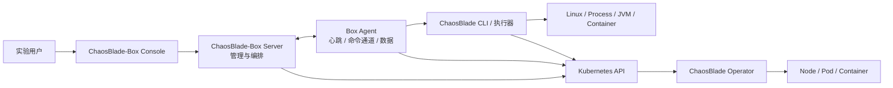
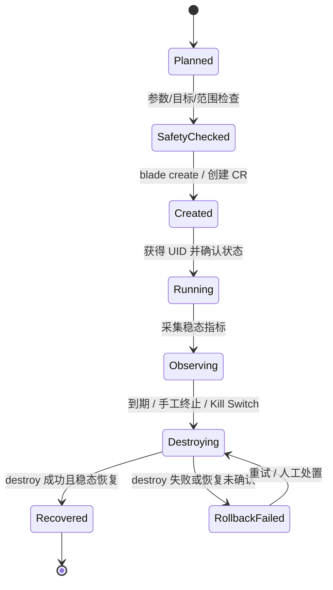
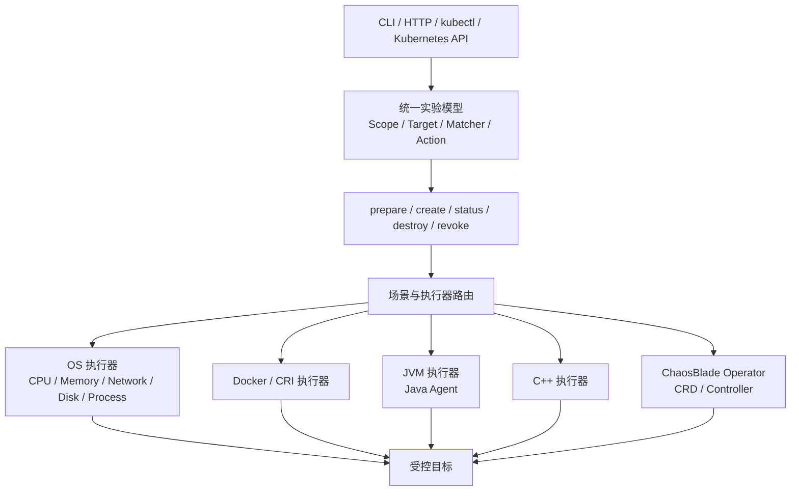

# ChaosBlade 官方组件与实验生命周期研究

> 调研日期：2026-08-21
> 信息范围：ChaosBlade 官方 GitHub、官方文档与 CNCF 官方项目页。本文只做架构研究，不复制源码，不执行故障。

## 1. 先理解混沌工程

### Chaos Engineering（混沌工程）

**概念**：通过受控实验主动引入现实中可能出现的故障，验证系统在异常条件下是否仍满足预先定义的稳态，而不是等待线上事故替我们测试。

**生活化例子**：消防演习不是为了烧掉大楼，而是在范围可控、人员知情、有撤离路线的情况下，验证报警器、应急通道和协作流程是否有效。

**代码中的作用**：实验必须有假设、目标、故障参数、持续时间、观测指标、停止条件和恢复步骤；“执行一条破坏命令”只占其中一小部分。

**ChaosLab 中的位置**：Experiment 保存假设与生命周期；SafetyGuard 控制风险；ChaosEngine 执行故障；Prometheus 观察稳态；Report 对比实验前/中/后；AuditLog 保留证据。

### Fault Injection（故障注入）

**概念**：用工具人为制造 CPU 压力、网络延迟、进程停止、方法异常等故障。

**生活化例子**：测试备用电源时主动切断主电源，但只在计划好的测试区域操作，并随时能恢复。

**代码中的作用**：它对应引擎的 `create`，但必须被校验、授权、限时和可回滚。

**ChaosLab 中的位置**：第一阶段由 FakeChaosEngine 模拟；安全系统完成后才由 ChaosBladeEngine 在本地 Linux 靶场真实执行。

### Steady State（稳态）

**概念**：系统正常运行时可以被指标描述的可接受行为，例如 99% 请求成功、P95 延迟小于 300ms。

**生活化例子**：电梯“正常”不是电机正在转，而是乘客能在规定时间内安全到达楼层。

**代码中的作用**：实验前建立基线，实验中判断偏离，恢复后判断是否回归。

**ChaosLab 中的位置**：实验假设与报告模块，后期通过 Prometheus 查询错误率和延迟分位数。

### Blast Radius（爆炸半径）

**概念**：一次故障可能影响的最大资源范围。

**生活化例子**：消防演习只封闭一层，而不是同时封闭整栋楼所有出口。

**代码中的作用**：限制目标数量、环境、namespace、标签、容器数和并发实验数。

**ChaosLab 中的位置**：SafetyGuard 默认只允许一个显式注册的 dev/test 目标；禁止 prod/production/online。

### Rollback / Recovery（回滚 / 恢复）

**概念**：移除故障效果，使目标回到实验前可接受状态；恢复动作本身也可能失败。

**生活化例子**：消防演习结束后不仅要宣布结束，还必须解锁通道、恢复电梯、清点人员并确认系统正常。

**代码中的作用**：调用 `destroy`，验证结果；失败进入 `ROLLBACK_FAILED`，触发重试、告警和人工处置，而不是假装实验成功。

**ChaosLab 中的位置**：自动恢复调度器、kill switch、崩溃恢复扫描和审计日志。

## 2. ChaosBlade 是什么，解决什么问题

ChaosBlade 是阿里巴巴开源、遵循混沌实验模型的故障注入工具集，覆盖基础资源、Java/C++ 等应用、容器和 Kubernetes 场景。它把不同执行器的场景统一到一套 CLI/HTTP 操作模型中。CNCF 官方项目页显示，ChaosBlade 于 2021-04-28 以 Sandbox 成熟度进入 CNCF。

它主要解决的是“如何以统一、可描述、可查询、可恢复的方式，在不同技术层注入故障”。它本身不是完整业务平台所需的用户、审批、RBAC、企业目标治理和报告数据库；这些是 ChaosLab 要重点学习的上层控制面能力。

官方资料：

- [ChaosBlade 官方仓库](https://github.com/chaosblade-io/chaosblade)
- [ChaosBlade 官方整体介绍](https://chaosblade.io/docs/)
- [CNCF ChaosBlade 项目页](https://www.cncf.io/projects/chaosblade/)

## 3. 四个核心项目分别是什么

### 3.1 chaosblade CLI / Toolkit

`chaosblade` 仓库提供统一的实验管理入口。官方 README 列出的核心命令包括：

| 命令 | 含义 | ChaosLab 后续对应 |
| --- | --- | --- |
| `prepare` | 为需要准备的实验建立环境，例如给 JVM 动态挂载 Java Agent | 引擎准备阶段；不能与 create 混为一个不可恢复动作 |
| `revoke` | 撤销 prepare 建立的环境 | 清理准备资源 |
| `create` | 创建并注入一个故障实验，成功后返回 UID | `ChaosEngine.create()` |
| `status` | 按 UID 查询准备或实验状态 | `ChaosEngine.status()` |
| `destroy` | 按 UID 或命令销毁实验、移除故障 | `ChaosEngine.destroy()` |
| `server` | 启动 HTTP 服务以远程调用工具 | 本项目首选受控本地进程/Agent 通道，不默认暴露该接口 |

CLI 是“工具入口”，底层具体能力来自 OS、Docker/CRI、JVM、C++、Operator 等执行器。业务平台不应该把 CLI 当作自己的领域模型；ChaosLab 必须保存自己的 Experiment、Execution、Target、Audit 与状态，再把一次批准后的执行翻译成 CLI/CRD。

### 3.2 chaosblade-box

ChaosBlade-Box 是上层混沌工程平台。官方文档把它描述为控制和编排中心，包含 Web Console、Server，以及实验引擎、Runner、经验库等能力；可管理目标/探针、托管执行工具、编排实验、接入监控并生成报告。

它和 CLI 的区别：

- CLI 面向一次工具操作；Box 面向多用户、多目标、多步骤的实验管理。
- CLI 在执行端制造/销毁故障；Box 负责选择目标、组织场景并下发执行。
- ChaosLab 学习 Box 的“平台问题”，但用自己的简化领域模型逐步实现，不复制 Box 源码。

官方资料：

- [chaosblade-box 官方仓库](https://github.com/chaosblade-io/chaosblade-box)
- [ChaosBlade-Box 平台介绍](https://chaosblade.io/en/docs/about-chaosblade/box-introduce/)

### 3.3 chaosblade-box-agent

Box Agent 是部署在目标主机或 Kubernetes 集群一侧的探针/执行通道。官方说明的核心职责是：

- 与 Box 平台建立连接并报告心跳。
- 接收平台下发的命令，把编排结果送到目标环境。
- 收集目标或执行相关数据。

生活化类比：Box 是调度中心，Agent 是驻场联络员。调度中心不必直接登录每台机器；驻场 Agent 报告“我在线”，接收经过授权的任务并返回结果。

Agent 不等于 ChaosBlade：Agent 解决“平台如何可靠联系执行端”，ChaosBlade 解决“执行端如何制造/销毁故障”。官方安装资料还指出，在 Kubernetes 中若要进行集群实验，需要额外安装 Operator。

官方资料：

- [chaosblade-box-agent 官方仓库](https://github.com/chaosblade-io/chaosblade-box-agent)
- [Agent 官方安装说明](https://chaosblade.io/en/docs/next/getting-started/installation-and-deployment/agent-install/)

### 3.4 chaosblade-operator

ChaosBlade Operator 是 Kubernetes 环境的实验控制器。它用 Kubernetes CRD 定义 `ChaosBlade` 自定义资源，通过 reconciliation（持续调谐）让实际故障状态靠近期望状态，并把执行状态写回资源 status。

生活化类比：用户提交的 CR 像一张“施工单”；Operator 像持续巡视的现场主管，不只接单一次，还会不断确认现场是否达到单据描述的状态。删除施工单时，它负责执行清理流程。

官方仓库说明可通过三种方式运行 Kubernetes 实验：提交 YAML、使用 blade CLI、调用 Kubernetes API。当前官方仓库还说明最低支持 Kubernetes 1.22；真正进入 Kubernetes 阶段时必须再次核验当时的兼容矩阵。

官方资料：

- [chaosblade-operator 官方仓库](https://github.com/chaosblade-io/chaosblade-operator)
- [Operator 官方 Releases](https://github.com/chaosblade-io/chaosblade-operator/releases)
- [Kubernetes 场景文档](https://chaosblade.io/docs/experiment-types/k8s/)

## 4. 四者之间的关系



这张图表示可能的职责路径，不表示每个部署都必须同时经过所有箭头。例如，个人可以直接在 Linux 主机使用 CLI；Kubernetes 用户可以直接提交 CR；Box 场景通常通过 Agent/执行器通道管理目标。

## 5. ChaosBlade 如何描述一个实验

ChaosBlade 官方模型把实验拆为四部分：

| 模型项 | 要回答的问题 | 示例 |
| --- | --- | --- |
| Scope | 影响范围在哪里 | 一台主机、一个集群或一个 Pod 集合 |
| Target | 对什么组件做实验 | cpu、network、process、dubbo、pod |
| Matcher | 哪些请求/资源命中 | 端口、IP、服务名、方法名、Pod 名称 |
| Action | 制造什么现象 | fullload、delay、loss、kill |

例如：

```bash
blade create network delay --time 300 --interface eth0 --remote-port 8080
```

可理解为：在当前主机 Scope 中，以 network 为 Target，以端口/网卡为 Matcher，执行 delay Action。真实参数必须以目标 ChaosBlade 版本的 `blade ... -h` 为准，本文示例不能直接成为平台可执行输入。

官方模型说明：[ChaosBlade 混沌实验模型](https://chaosblade.io/docs/community/java-dev-guide/model/)

ChaosLab 会采用更上层且更严格的模型：

```text
Experiment（目的、假设、时长、状态）
  ├─ Target（已注册目标与环境）
  ├─ FaultScenario（允许的场景定义）
  ├─ Parameters（类型化并通过范围校验）
  ├─ SafetyDecision（允许/拒绝与理由）
  └─ ExperimentExecution（一次真实/模拟执行及引擎 UID）
```

## 6. 如何创建、查询和销毁实验

### 创建

1. 选择明确 Target、Action 和 Matchers。
2. 本地检查参数和执行权限。
3. 执行 `blade create ...`。
4. 解析结构化输出；成功时保存实验 UID，不能只保存一段日志。

### 查询

使用 `blade status <UID>` 查询实验状态。旧版本文档或部分 Operator 示例曾出现 `query` 形式；本项目接入时不靠记忆兼容，而是锁定一个经过测试的工具版本并以该版本 `--help`/官方说明建立适配器测试。

### 销毁

使用 `blade destroy <UID>` 移除该 UID 对应的故障。Kubernetes CRD 模式通常通过删除 `ChaosBlade` 自定义资源触发 Operator 清理；平台必须继续观察 status/资源消失和业务稳态恢复，不能把“已发送 delete”当作“已恢复”。

完整生命周期：



## 7. 为什么必须 destroy

`create` 改变了目标运行状态；`destroy` 是撤销这项改变的显式生命周期操作。若不恢复：

- CPU/内存压力可能持续消耗资源，拖垮同机其他测试服务。
- 网络 delay/loss 规则可能继续影响后续请求，使排障者误以为应用有新缺陷。
- 被挂起的进程无法继续服务；磁盘填充文件可能长期占用空间。
- JVM 注入规则可能继续改变方法行为。
- 实验污染后续测试数据，导致结果不可复现。
- 在范围识别错误时，影响可能扩散为事故。

因此 ChaosLab 的完成条件不是“已调用 destroy”，而是：

```text
已发起恢复
  + 引擎确认恢复成功
  + 目标健康检查通过
  + 稳态指标回归（在允许窗口内）
  + 审计记录完整
```

如果 destroy 失败，必须保留引擎 UID、目标、原参数、错误输出和下一次重试信息，进入 `ROLLBACK_FAILED` 并发出高优先级告警。

官方命令资料：[blade destroy](https://chaosblade.io/en/docs/1.7.1/getting-started/chaosblade-tool-quick-start/cli-mode-user-guide/blade-destroy/)

## 8. ChaosBlade 整体架构



ChaosBlade 的关键价值在统一模型与丰富执行器；ChaosLab 的关键价值在执行之前与之后：谁能做、打谁、为何做、能影响多少、持续多久、观察什么、何时停止、是否恢复、如何审计。

## 9. Windows 平台结论与本项目选择

本次官方仓库最新发布信息中的 Blade AI/ChaosBlade 工具包提供 Linux/macOS 构建，经典故障执行又依赖 Linux 的进程、cgroup、network namespace、`tc` 等能力。官方文档的部署/场景也以 Linux、Docker、Kubernetes 为核心，没有把 Windows 原生故障注入列为本项目可以依赖的路径。

所以当前结论不是“ChaosBlade 永远不支持任何 Windows 场景”，而是更审慎的工程决定：**ChaosLab 的控制面可以在 Windows 开发，真实故障执行面必须放在专用 Linux 隔离环境。** 优先顺序：Docker Linux container → WSL2/专用 Linux VM → kind/minikube；任何时候不攻击 Windows 宿主机或未知远端。

## 10. 当前官方版本信息的使用原则

截至调研日，官方仓库发布页显示 ChaosBlade-Box 最新稳定 release 为 `v1.1.0`、Operator 为 `v1.8.0`；ChaosBlade 主仓库最新 release 流同时包含 Blade AI，并捆绑 `v1.9.0-alpha` 工具，因此“页面最新”不自动等于 ChaosLab 应采用的稳定执行器版本。

真正接入时执行以下版本决策流程：

1. 明确只需要的场景与操作系统/架构。
2. 阅读目标 release notes、校验和、已知问题与 Operator 兼容性。
3. 在隔离容器运行 create/status/destroy 探针测试。
4. 在配置与镜像 digest 中锁定版本，不使用漂移的 `latest`。
5. 把升级作为独立 ADR 和回归测试，不在普通功能提交里顺手升级。

官方 release 页：

- [ChaosBlade Releases](https://github.com/chaosblade-io/chaosblade/releases)
- [ChaosBlade-Box Releases](https://github.com/chaosblade-io/chaosblade-box/releases)
- [ChaosBlade Operator Releases](https://github.com/chaosblade-io/chaosblade-operator/releases)

## 11. 调研结论

1. ChaosBlade 是故障执行工具集；ChaosBlade-Box 是平台控制面；Box Agent 是执行端连接/下发/采集通道；Operator 是 Kubernetes 声明式控制器。
2. 一次实验必须明确 Scope、Target、Matcher、Action，并保存可查询、可销毁的标识。
3. destroy 是实验正确性与安全性的一部分，不是可选的收尾命令。
4. ChaosLab 应借鉴职责边界而不是复制源码：自己的领域状态、安全决策和审计记录必须独立于具体引擎。
5. 当前 Windows 开发环境不直接承担真实注入；先使用 Fake，再在专用 Linux 靶场接入 ChaosBlade。
6. 官方网页存在不同版本文档并存现象；代码接入必须锁定 release，并以该版本的帮助输出和集成测试消除差异。
