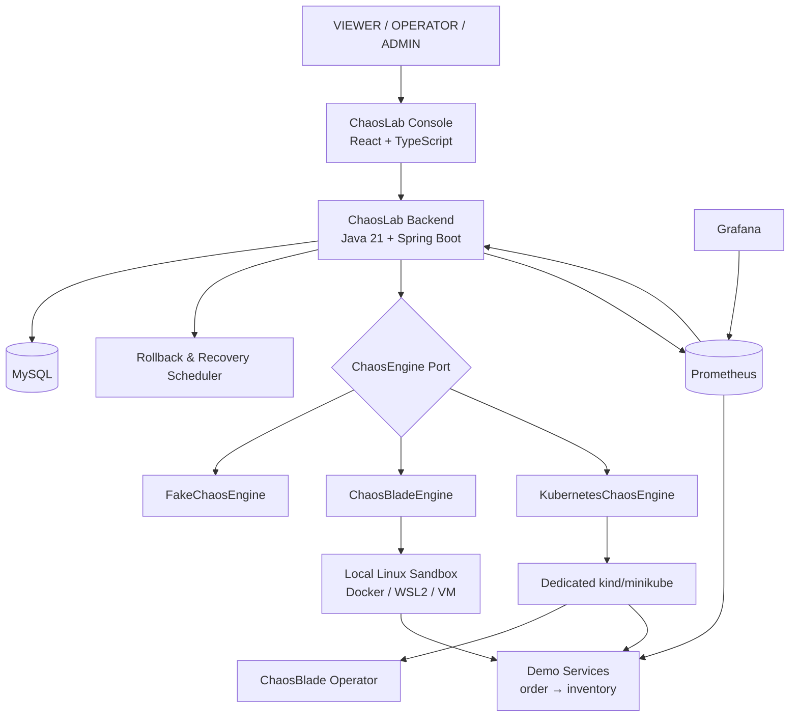
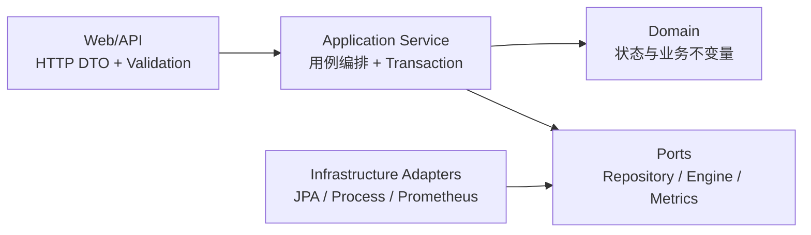
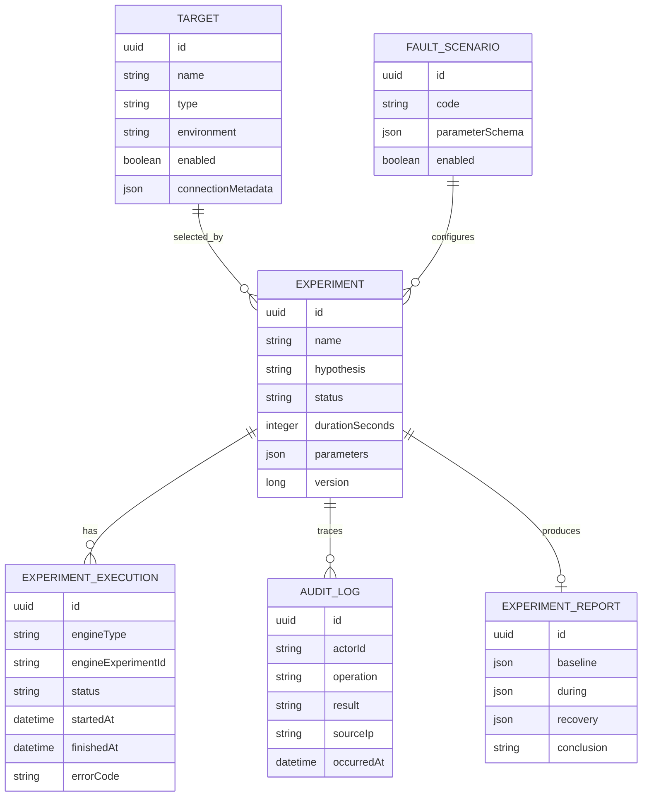
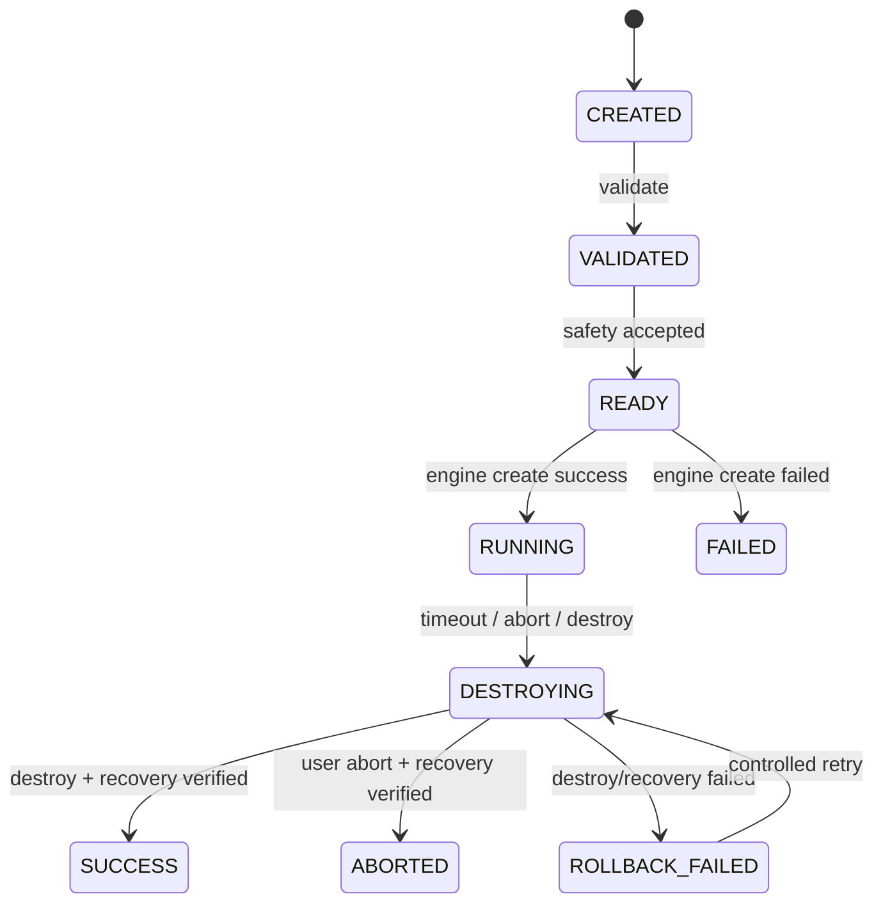
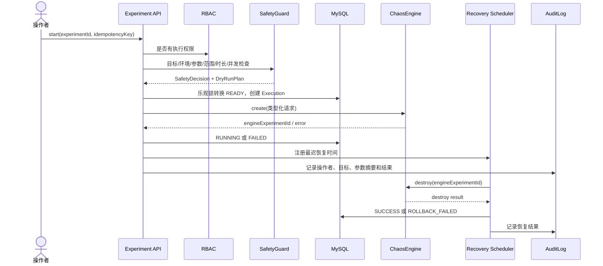
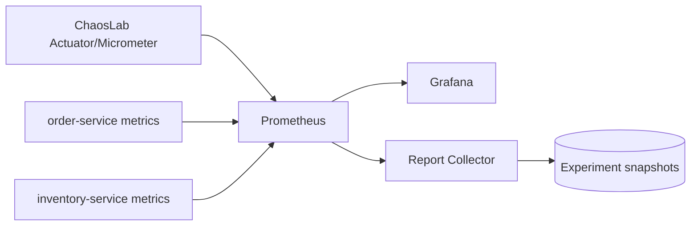
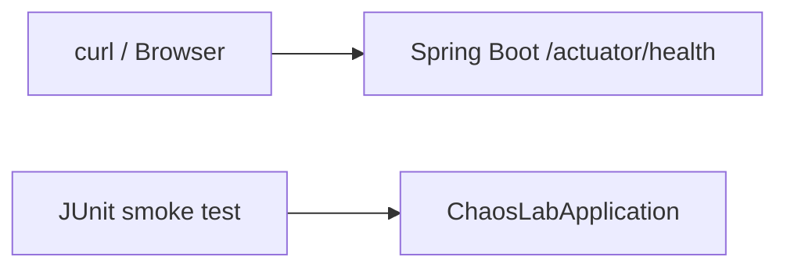

# ChaosLab 总体架构设计

> 文档状态：目标架构与演进约束，不代表当前已实现。
> 设计日期：2026-08-21

## 1. 架构目标

ChaosLab 要同时满足三个目标：

1. **适合学习**：每一层能单独解释、运行和测试，避免一开始被十几个微服务与 Kubernetes 淹没。
2. **默认安全**：真实故障必须经过身份、目标、场景、参数、范围、时长和并发检查；失败时优先恢复。
3. **可以演进**：先 Fake，后 ChaosBlade，再 Operator；替换执行技术不重写实验、权限、审计与报告。

不在第一天采用微服务。当前团队/学习者只有一个后端部署单元，数据库事务和调试反馈比独立扩缩容更重要。模块化单体通过代码边界训练领域拆分，同时保留以后拆服务的可能。

## 2. 最终系统上下文



关键边界：

- Console 只改善交互，不能成为安全规则来源；绕过前端调用 API 仍必须安全。
- Backend 是控制面，保存权威实验状态和审计事实。
- ChaosEngine 是端口（port）；Fake/Blade/Kubernetes 是适配器（adapter）。
- Demo Services 是唯一默认故障靶场；ChaosLab 自身、MySQL 和宿主机不作为目标。
- Prometheus 是指标数据源，不替代事务数据库中的实验状态。

## 3. 为什么这样拆模块

建议后端采用“按业务模块优先、模块内再分层”的结构：

```text
backend/src/main/java/.../chaoslab/
├── experiment/     实验定义、生命周期与执行记录
├── target/         显式注册的目标及环境属性
├── scenario/       允许的故障类型和参数 schema
├── engine/         ChaosEngine 端口和各适配器
├── safety/         运行前策略、范围、时长、并发、kill switch
├── audit/          不可忽略的危险操作审计
├── monitoring/     平台指标、稳态查询和报告数据
├── security/       认证、RBAC 与当前操作者
└── common/         真正跨模块的错误协议、时间等极少量基础能力
```

### 生活化理解

把系统想成医院：挂号、检验、药房、收费各有职责。每个科室内部都有接待窗口（API）、业务人员（application/service）和资料柜（repository）。如果只按“所有窗口放一层、所有资料柜放一层”组织，找一次完整业务要横跨整个项目；按业务模块组织更容易看清谁拥有数据和规则。

### 工业项目的取舍

- `experiment` 拥有状态转换，不能让 Controller 直接改 status 字段。
- `target` 负责注册事实；是否允许攻击由 `safety` 综合环境、场景和当前运行情况判断。
- `scenario` 保存“允许什么参数”，`engine` 只翻译已经验证的类型化命令。
- `audit` 不能依赖普通成功日志，因为失败和拒绝同样要可追溯。
- `common` 不能变成杂物间；仅放真正稳定、跨模块的契约。

## 4. 分层职责

一个模块内部使用轻量分层，而不是为每个类机械创建接口：



| 层 | 做什么 | 不做什么 |
| --- | --- | --- |
| Web / Controller | 解析 HTTP、Bean Validation、调用用例、映射响应 | 不写状态机、不调 shell、不捕获所有异常 |
| Application Service | 编排一个用例、事务边界、调用领域和端口 | 不拼 ChaosBlade 字符串、不放 SQL |
| Domain | 实验状态转换、持续时间等业务不变量 | 不依赖 HTTP、JPA 或具体 ChaosBlade |
| Repository Adapter | 持久化和查询 | 不决定实验能否启动 |
| Engine Adapter | 类型化请求翻译为 Fake/CLI/CRD，并返回标准结果 | 不绕过 SafetyGuard、不自行选择未知目标 |

## 5. 核心领域关系



这里只是概念关系，最终列类型、索引、外键、JSON 使用范围和敏感元数据拆分将在数据库设计阶段以 Flyway migration 固化。

## 6. 实验状态机

### 为什么不用 boolean

如果使用 `running`、`failed`、`destroyed` 三个 boolean，会产生 `running=true && destroyed=true` 等矛盾组合，而且无法表达“已验证但未开始”“正在恢复”“恢复失败”。状态机把合法状态和合法转换同时建模。



非法例子：`SUCCESS → RUNNING`、`CREATED → DESTROYING`。所有转换由领域对象或专门状态策略执行，并通过数据库 `version` 乐观锁防止两个请求同时覆盖。

`Experiment` 表示用户定义及总状态；`ExperimentExecution` 表示每次实际执行尝试。分开后，可以记录 create 失败后的重试、恢复重试和引擎 UID，而不丢失实验定义。

## 7. ChaosEngine 抽象

目标接口表达业务需要，不泄漏某个 CLI 的字符串格式：

```java
public interface ChaosEngine {
    CreateResult create(ValidatedExperimentRequest request);
    EngineStatus status(EngineExperimentId id);
    DestroyResult destroy(EngineExperimentId id);
}
```

这里应用了 Adapter Pattern：插座标准不关心电来自电网、发电机还是测试电源。ChaosLab 的 Service 依赖插座标准 `ChaosEngine`；Fake、ChaosBlade CLI、Kubernetes CRD 分别是不同适配器。

收益：

- 业务状态机不依赖命令行输出格式。
- Fake 可确定性模拟异常，单元测试无需 root 权限。
- 升级 ChaosBlade 或换 Operator，只改适配器与契约测试。
- Engine 不能获得“自由执行任意命令”的接口，缩小命令注入面。

## 8. 安全执行流水线



### SafetyGuard 最小策略

| 检查 | 默认规则 |
| --- | --- |
| Target allowlist | 只允许数据库中显式注册且 enabled 的目标 |
| Production protection | `prod`、`production`、`online` 一律拒绝 |
| 环境允许列表 | 初期只允许 `local`、`dev`、`test`、`chaos-lab` |
| Maximum duration | 场景级上限与平台硬上限取更小值 |
| Blast radius | 初期一次只允许一个容器或一个 Pod |
| Concurrency | 平台全局限制 + 同一 Target 互斥 |
| Dry Run | 返回规范化参数、目标、影响范围、恢复期限，不执行 |
| Kill Switch | ADMIN 可阻止新实验并并发触发所有运行中实验恢复 |

SafetyGuard 输出结构化 Decision（允许/拒绝、规则编号、原因），而不是一个 `boolean`，便于 API 提示、审计和测试。

## 9. CommandBuilder 与命令注入防护

禁止这种接口：

```java
execute(request.getCommand());
```

如果用户输入 `300; <另一条命令>` 被 shell 解释，就可能从“设置延迟”变为执行任意系统命令。即使做字符串转义，也容易遗漏不同 shell 和参数的边界。

正确方向：

1. API 只接受场景枚举与类型化 DTO，例如 `delayMs: 300`。
2. Bean Validation 检查格式，ScenarioValidator 检查业务范围。
3. TargetRegistry 解析内部目标标识，不接受任意 IP/容器名。
4. CommandBuilder 从可信枚举映射固定 token，输出参数数组。
5. `ProcessBuilder(List<String>)` 直接启动 blade，不经过 `cmd.exe`/`sh -c`。
6. 限制超时、输出大小、工作目录、环境变量和执行用户。
7. 日志记录规范化计划与结果，但脱敏密钥、JWT 和连接凭证。

CommandBuilder 仍然不能代替 SafetyGuard：前者保证“命令结构安全”，后者判断“这次实验是否应该执行”。

## 10. 自动恢复与控制面崩溃

只把 Java 定时任务放在内存里不够：ChaosLab 在故障运行时重启，内存 timer 会消失。恢复设计需要：

- 数据库保存 `engineExperimentId`、`mustDestroyAt`、执行状态和重试次数。
- 启动扫描器查找 `RUNNING/DESTROYING/ROLLBACK_FAILED` 的到期记录。
- 恢复操作按 execution 幂等；重复 destroy 的结果要被分类处理。
- 一个实例通过数据库锁/租约获得恢复任务，避免多实例重复竞争。
- destroy 成功后继续做健康与稳态验证。
- 超过重试上限后告警并保留人工处置手册，绝不把状态改成 SUCCESS。

更后期可让执行端 Agent 持有“故障租约/TTL”，即使控制面失联也在 TTL 到期后自恢复；这属于真实引擎阶段的高级安全增强。

## 11. 可观测性架构



平台指标回答“实验系统发生了什么”：总数、运行数、失败数、持续时间、恢复失败数。业务指标回答“靶场稳态发生了什么”：请求量、错误率、P95/P99、JVM、CPU、内存。二者通过 experiment 时间窗口与 labels/annotations 关联，但避免在指标 label 中放高基数字段或秘密信息。

## 12. 部署拓扑与网络边界

第一套可复现环境采用 Docker Compose：

```text
management network:
  ChaosLab Backend ─ MySQL ─ Prometheus ─ Grafana

target network:
  order-service ─ inventory-service

execution boundary:
  ChaosBlade executor 只获得访问 target network/容器所需的最小权限
```

管理网络与靶场网络逻辑隔离。数据库不暴露给靶场；Demo 服务不能回连管理 API 执行命令；ChaosBlade 所需特权只授予专用执行容器，不授予 Backend 主进程。Compose 阶段会根据实际能力验证是否能进一步物理分离。

## 13. REST API 设计方向

资源使用名词，生命周期动作在资源子路径表达，因为 validate/start/abort/destroy 不是简单替换 Experiment 全部字段：

```text
POST   /api/v1/targets
GET    /api/v1/targets
GET    /api/v1/scenarios
POST   /api/v1/experiments
GET    /api/v1/experiments/{id}
POST   /api/v1/experiments/{id}/validation
POST   /api/v1/experiments/{id}/dry-run
POST   /api/v1/experiments/{id}/executions
POST   /api/v1/experiments/{id}/abortions
GET    /api/v1/experiments/{id}/report
```

最终路径会在 API 设计阶段通过用例、幂等性语义和 HTTP 状态码评审后确定，不机械照抄本草案。

## 14. 预期仓库结构

```text
ChaosLab/
├── backend/          Spring Boot 模块化单体
├── frontend/         后期 React 控制台
├── demo-services/    可重建的专用故障靶场
├── deploy/           Prometheus/Grafana/Kubernetes 配置
├── docs/             架构、设计、学习记录、排障
│   └── adr/          不可逆或重要设计决策
├── scripts/          明确用途且安全的开发/验证脚本
├── docker-compose.yml
└── README.md
```

目录随阶段按需创建，不预先生成空包和空服务。这样每次 commit 都能说明新增目录为何存在，并有可运行或可验证的内容。

## 15. 当前阶段与下一架构增量

当前只有文档，没有运行时组件。下一阶段的最小架构增量仅是：



不会在同一阶段同时加入 MySQL、JWT、ChaosBlade、Prometheus、前端和 Kubernetes。先证明 Java 21 + Spring Boot 构建、测试和运行链路稳定，再逐层增加复杂性。

## 16. 架构验收原则

每次演进都用以下问题审查：

- 新模块是否有独立业务职责，还是为了“看起来工业化”？
- 危险输入是否在进入执行器前完成类型、范围、目标和权限校验？
- 状态与外部副作用失败时是否可恢复、可重试、可审计？
- ChaosLab 崩溃后是否还能知道哪些故障可能仍在运行？
- 测试能否在不注入真实故障时覆盖核心状态和异常路径？
- 新组件是否有明确运行说明、健康检查、最小权限和卸载方式？
- 这次改动能否形成一个独立、可解释、测试通过的 Git commit？
